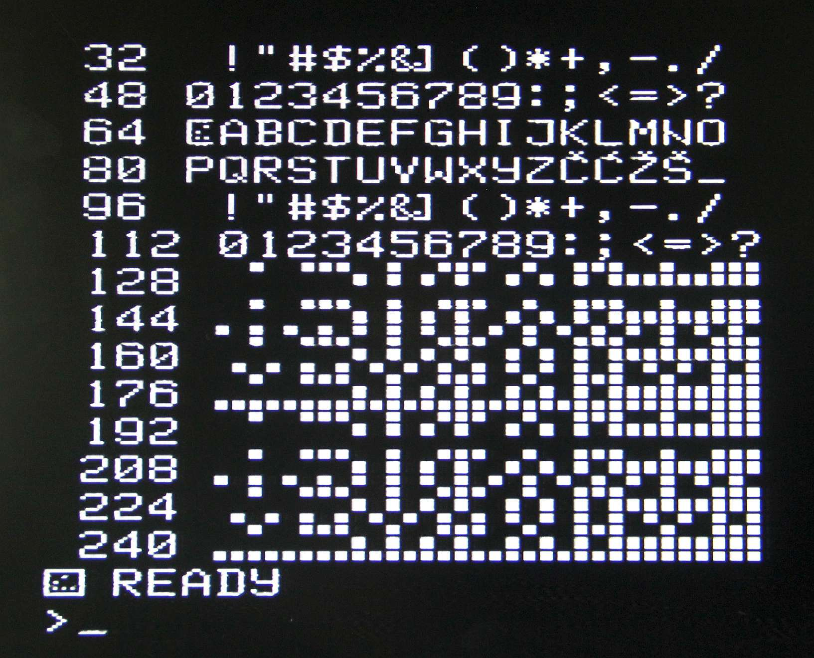

# Galaksija keyboard rom

Ich habe mir den PS2 Tastaturadapter angesehen. Die Dekodierungssoftware im 16F628A wird praktisch nicht genutzt. Es scheint die Software aus einem anderen Projekt zu sein. Sie wird mit einem sehr einfachen Hack für das Galaksija genutzt.

Dabei werden lediglich die unteren 7 Bit des Letzen Scann Code-Bytes einer Taste an ROM Adresse A7..A13 gelegt. A0..A6 sind die Ausgänge des Galaksija 74LS145. Die Daten D0..7 bilden die Eingänge des 74LS251 auf dem Galaksija. A14 am ROM ist dann noch mit der Shift-Taste der Tastatur "verbunden". (1=Shift gedrückt, 0=nicht gedrückt)

Das bedeutet, die Scann Codes können mit gewissen Einschränkungen über den ROM in beliebige Tastatureingaben des Galaksija umgewandelt werden. Da immer der Scann Code der letzten gedrückten Taste am ROM anliegt kann die Mehrfachbetätigung von Tasten nicht ausgewertet werden.

Ich habe mir für die Erstellung des ROM ein Excel File gemacht und einen ROM für das Tastaturlayout DE gemacht. Das EN Layout werde ich bei Gelegenheit überarbeiten.
Der Zeichensatz des Galaksija besitzt kein einfaches Hochkomma, obwohl auf der Original Galaksija Tastatur vorhanden.

## Zeichensatz Galaksija

